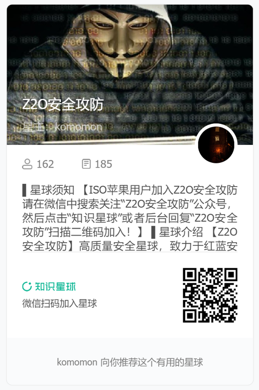

## fofa_filter_plus-白嫖fofa所有资产

### **简述**

在wuuconix的插件的基础之上进行修改和添加方法，实现可以通过fofa语法过滤资产，进而绕过fofa会员限制，查看60条以后的数据。

本脚本基于油猴插件开发。

### **解决问题**：

fofa对于普通用户只开放前60条数据的查看权限，如果目标资产大于60，我们将无法查看60条之后的资产。

### 安装

1 首先下载这个库

2 油猴插件选择管理面板


3 油猴选择新增插件


4 把fofa_filter_plus.js粘贴进去然后ctrl+s保存即可。


### **功能**

- 实现通过host title ip 三种方式进行搜索的资产过滤，这三种方式分别适用于不同场景。当指向按钮的时候也会显示提示信息。


- 当访问每页资产的时候会默认在console中输出当前页的资产的host信息，方便存储，以便于用于其他工具，比如用于[Komo](https://github.com/komomon/Komo)，一款集成了20余款工具的综合资产收集和漏洞扫描工具


​		收集到的资产存储到文件，调用[Komo](https://github.com/komomon/Komo)

```python
finger # 对url进行进行存活探测和指纹识别
python3 Komo.py --urls ./urls.txt finger

sensitive # 调用crawlergo rad gau URLfinder等多款工具对收集到的存活域名或域名文件进行url爬取
python3 Komo.py --urls ./urls.txt sensitive

webattack # 对收集到的存活域名或域名文件进行url爬取，然后发送给xray进行扫描，同时也调用nuclei，afrog，vulmap，vscan进行漏洞扫描
python3 Komo.py --urls ./urls.txt webattack
```

- 当点击下面的页面，切换其他页的时候，fofa会异步加载数据，而不是整页刷新，通过hook方式，点击任何一页都会在console中输出当前页资产的host信息


### 使用场景举例

- 当搜索**某目标的全资产**的时候，适合剔除已查看到的host资产即剔除url或者title，此时要使用第一个按钮HO（Host）TI (Title)

```
"dada"
```

点击HO，通过host过滤资产

```
"dada" && host!="https://mail.suppressednews.com" && host!="https://suppressednews.com" && host!="tienda.invhid.com" && host!="mail.suppressednews.com" && host!="https://tienda.invhid.com" && host!="https://www.suppressednews.com" && host!="159.89.176.77" && host!="206.189.181.220" && host!="67.208.117.86" && host!="47.114.196.97"
```


- 当根据**组织org或者挖掘通用性漏洞搜**索资产时，则需要过滤ip来查看更多资产

```
org="DIGITALOCEAN-ASN"
```

点击IP按钮

```
org="DIGITALOCEAN-ASN" && ip!="161.35.10.4" && ip!="206.189.60.188" && ip!="46.101.138.220" && ip!="143.110.250.157" && ip!="178.62.92.110" && ip!="143.244.138.72" && ip!="161.35.133.198" && ip!="167.172.14.213" && ip!="162.243.13.125" && ip!="128.199.84.109"
```


## 一起交流

感兴趣的可以关注 **Z2O安全攻防** 公众号回复“**加群**”，添加Z2OBot 小K自动拉你加入**Z2O安全攻防交流群**分享更多好东西。


团队建立了知识星球，不定时更新最新漏洞复现，手把手教你，同时不定时更新POC、内外网渗透测试骚操作。感兴趣的可以加一下。





**欢迎star:star: O(∩_∩)O**


